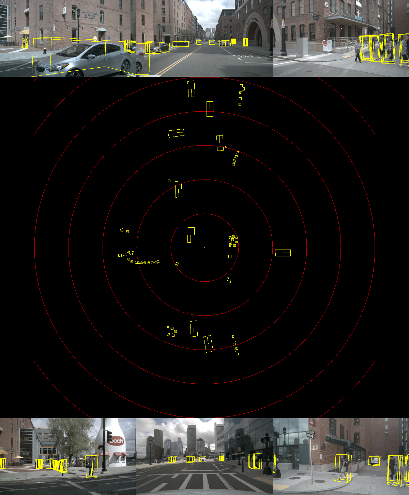
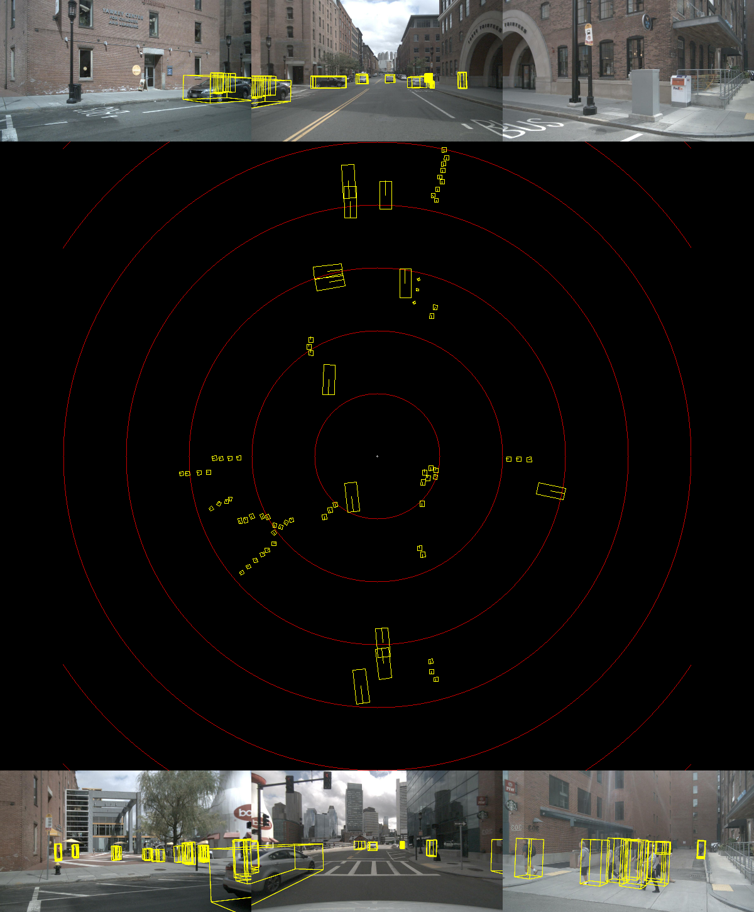

# CUDA-FastBEV — 高性能纯视觉 BEV 3D 目标检测

基于 NVIDIA TensorRT 的 [FastBEV](https://github.com/Sense-GVT/Fast-BEV) 纯相机 BEV 感知推理框架。支持 NuScenes 原始数据、多帧视频可视化、多目标跟踪接口及 ROS Noetic 实时接口。

> **原版说明**: This repository contains sources and model for Fast-BEV inference using CUDA & TensorRT, with PTQ/QAT int8 quantization support.

**完整链路**：`多相机图像 → 标定/同步 → BEV 检测 → 多目标跟踪 → 轨迹输出 → ROS/系统集成`
---

## 目录结构

```
CUDA-FastBEV/
├── src/                        # C++ 推理核心
│   ├── main.cpp                # 推理入口（支持过滤/JSON/批量模式）
│   ├── tracking_demo.cpp       # BEV 检测+跟踪批量入口
│   ├── joint_inference.cpp     # 联合感知主程序（BEV + MapTR）
│   ├── fastbev/                # FastBEV 预/后处理模块
│   ├── common/                 # 张量、可视化、Timer 等公共组件
│   ├── tracking/               # 多目标跟踪模块（track.hpp / tracker.hpp）
│   ├── camera/                 # 相机帧管理、多路缓冲、标定加载
│   ├── pipeline/               # 完整感知管线（检测+跟踪+回调）
│   └── perception/             # 联合感知接口（图像预处理 + MapTR 包装）
├── tools/                      # Python 工具链
│   ├── nuscenes_adapter.py     # NuScenes 原始数据 → C++ 帧目录（✅ 支持 v1.0-mini）
│   └── video_demo.py           # 多帧 BEV+相机视频生成
├── ros/                        # ROS Noetic 接口
│   ├── fastbev_ros_node.cpp
│   ├── CMakeLists.txt
│   ├── package.xml
│   └── launch_fastbev_node.sh
├── tool/                       # 原有脚本
│   ├── draw.py                 # 单帧可视化
│   ├── build_trt_engine.sh
│   ├── run.sh
│   └── environment.sh
├── data/nuscenes/              # NuScenes 数据集（v1.0-mini 已验证）
├── model/                      # TRT 模型文件
├── configs/                    # 模型配置
├── ptq/                        # 量化工具
└── example-data/               # 示例数据
```

---

## 性能指标（NuScenes val）

| 模型 | 框架 | 精度 | mAP | FPS |
|:----:|:----:|:----:|:---:|:---:|
| ResNet18 | TensorRT | FP16 | 24.3 | 113.6 (RTX 2080Ti) |
| ResNet18-PTQ | TensorRT | FP16+INT8 | 23.89 | 143.8 |
| ResNet18-head-PTQ | TensorRT | FP16+INT8 | 23.83 | 144.9 |

---

## 环境依赖

- CUDA ≥ 11.0，CUDNN ≥ 8.2，TensorRT ≥ 8.5.0
- libprotobuf-dev == 3.6.1，Compute Capability ≥ sm_80
- Python ≥ 3.6（`conda activate bev`）

---

## 快速开始

### 1. 下载模型和数据

```bash
# 下载并解压（Google Drive）
unzip model.zip
unzip nuScenes-example-data.zip
```

### 2. 配置环境

```bash
# 修改 TensorRT/CUDA 路径后激活
source tool/environment.sh
# 配置推理所需要的环境
bash tools/maptr/setup_maptr_env.sh
```

### 3. 编译 TRT 引擎 + C++ 程序

```bash
bash tool/build_trt_engine.sh
mkdir -p build && cd build && cmake .. && make -j$(nproc) && cd ..
```

### 4. 单帧推理

```bash
# 基本推理（输出 TXT）
./build/fastbev example-data resnet18

# 带过滤参数（JSON 输出）
./build/fastbev example-data resnet18 fp16 \
    --score-thr 0.4 --classes 0,8 --output-format json

# 单帧可视化
python tool/draw.py --pred-path model/resnet18/result.txt 
                    --vis-path  model/resnet18/vis.png
```

---

## Step 1 · NuScenes 数据适配

```bash
conda activate bev

# ✅ 推荐：直接读取原始 NuScenes 数据集（无需 mmdet3d）
python tools/nuscenes_adapter.py 
    --nuscenes-dir data/nuscenes 
    --version      v1.0-mini 
    --out-dir      outputs/frames 
    --num-frames   50  --skip-geometry

# 指定场景（scene-0061 等）
python tools/nuscenes_adapter.py 
    --nuscenes-dir data/nuscenes 
    --version      v1.0-mini 
    --out-dir      outputs/frames 
    --scene-names  scene-0061,scene-0103 
    --num-frames   100

# NuScenes pkl 模式（需要 mmdet3d 预处理的 pkl）
python tools/nuscenes_adapter.py 
    --pkl-path      /data/nuscenes/nuscenes_infos_val.pkl 
    --nuscenes-root /data/nuscenes 
    --out-dir       outputs/frames 
    --num-frames    50
```

每帧输出：`valid_c_idx.tensor`（[6,160000] float32）、`x.tensor`、`y.tensor`（[6,160000] int64）+ 6 路相机图像。

---

## 帧目录数据格式（`outputs/frames/`）

本节说明 `joint_inference` 读取的帧数据结构，供**基于自定义摄像头**的开发者参考。

### 目录结构

```
outputs/frames/
└── frame_00000/          ← 每帧一个子目录，编号从 0 开始
    │
    │  # ── 必须文件 ─────────────────────────────────────────
    ├── 0-FRONT.jpg        ← 正前方相机，704×256 RGB
    ├── 1-FRONT_RIGHT.jpg  ← 右前
    ├── 2-FRONT_LEFT.jpg   ← 左前
    ├── 3-BACK.jpg         ← 正后方
    ├── 4-BACK_LEFT.jpg    ← 左后
    ├── 5-BACK_RIGHT.jpg   ← 右后
    ├── meta.json          ← 标定 + ego 位姿（必须，详见下方）
    │
    │  # ── 可选：预计算几何张量（无此文件则在线计算，略慢）───
    ├── valid_c_idx.tensor ← [6, 160000] float32  体素→相机可见性
    ├── x.tensor           ← [6, 160000] int64    投影特征图 x 坐标
    ├── y.tensor           ← [6, 160000] int64    投影特征图 y 坐标
    │
    │  # ── joint_inference --save-json 的输出 ──────────────
    ├── tracks.json        ← 跟踪轨迹（每帧）
    ├── result.json        ← 原始 BEV 检测框（每帧）
    ├── joint_result.json  ← 联合结果（BEV + 地图元素合并）
    └── map_result.json    ← MapTR 地图推理结果（由后台线程写入）
```

### meta.json 字段说明

```jsonc
{
  "frame_idx":   0,                        // 帧编号
  "timestamp":   1631883446650176,         // 微秒时间戳
  "origin":      [0.0, 0.0, -1.0],        // 体素网格中心（勿修改）

  // 6 路相机名称（固定顺序，不可更改）
  "camera_names": ["FRONT", "FRONT_RIGHT", "FRONT_LEFT",
                   "BACK",  "BACK_LEFT",   "BACK_RIGHT"],

  // 自车全局位姿（用于跟踪 ego 运动补偿）
  "ego_translation_global": [1234.5, 678.9, 0.0],   // [x, y, z] 米
  "ego_yaw_global":          1.23,                   // 弧度，全局坐标系

  // ── 标定数据（用于在线计算几何张量）─────────────────────────────────
  // lidar→camera 外参矩阵（4×4，row-major）
  // E[:3,:3] = R_cam.T @ R_lidar
  // E[:3, 3] = R_cam.T @ (t_lidar - t_cam)
  "lidar2cam_extrinsics": [
    [[r00,r01,r02,tx],[r10,r11,r12,ty],[r20,r21,r22,tz],[0,0,0,1]],  // FRONT
    // ... 共 6 路
  ],

  // 相机内参（对应 1600×900 原始分辨率，脚本自动缩放到 704×256）
  // [[fx,0,cx],[0,fy,cy],[0,0,1]]
  "cam_intrinsics_raw": [
    [[1266.4,0,816.3],[0,1266.4,491.5],[0,0,1]],  // FRONT
    // ... 共 6 路，无效相机填 null
  ]
}
```

**内参缩放公式**（C++ 和 Python 均执行）：
```
resize_scale = 704 / orig_width      (= 0.44 for 1600px)
crop_y_off   = (orig_height × resize_scale - 256) / 2
K_scaled[0]  = K_raw[0] × resize_scale
K_scaled[1]  = K_raw[1] × resize_scale
K_scaled[1,2] -= crop_y_off
```

### 输出 JSON 格式

**`tracks.json`**（`joint_inference` 和 `tracking_demo` 均写此格式）：
```json
[
  {
    "track_id": 1,
    "position": [x, y, z],     // 自车坐标系，单位米
    "size":     [w, l, h],      // 宽度(侧向), 长度(前向), 高度
    "yaw":      0.52,           // 偏航角，弧度，自车坐标系
    "velocity": [vx, vy],       // 速度，米/秒
    "score":    0.87,
    "class_id": 0               // 0=car, 1=truck, ...
  }
]
```

**`joint_result.json`**（`joint_inference --save-json` 写入）：
```json
{
  "frame_id": 0,
  "timestamp": 1631883446650176,
  "bev_latency_ms": 7.2,
  "map_latency_ms": 0.1,
  "tracks":     [ /* 同 tracks.json 格式 */ ],
  "detections": [ {"x","y","z","l","w","h","yaw","score","class_id"} ],
  "map": {
    "source": "model",          // "model" | "gt" | "trajectory" | "none"
    "elements": [
      {
        "type":  0,             // 0=divider(车道分隔线), 1=boundary(路沿), 2=ped_crossing
        "score": 0.92,
        "pts":   [[x0,y0],[x1,y1],...]   // 折线点，ego 坐标系，单位米
      }
    ]
  }
}
```

### 生成帧数据的方法

| 数据来源 | 脚本 | 说明 |
|----------|------|------|
| NuScenes 数据集 | `tools/nuscenes_adapter.py` | 推荐，完整标定自动提取 |
| 端到端推理脚本 | `tools/infer_from_images.py` | NuScenes 或图像目录，含推理 |
| **自定义摄像头** | **`tools/prepare_frame_dir.py`** | **仅准备数据，不做推理** |

**方式 A：从 NuScenes 准备**（已有 NuScenes 数据集）

```bash
python tools/nuscenes_adapter.py \
    --nuscenes-dir data/nuscenes --version v1.0-mini \
    --out-dir outputs/frames --num-frames 50
```

**方式 B：从自定义摄像头准备**（摄像头开发者首选）

```bash
# 1. 打印标定模板，按格式填写 calib.json
python tools/prepare_frame_dir.py --print-template > calib.json

# 2. 编辑 calib.json，填入相机内参和外参

# 3. 将 6 路图像 + calib.json 打包为帧目录
python tools/prepare_frame_dir.py \
    --images-dir /path/to/cam_images \   # 含 0-FRONT.jpg 等文件
    --meta calib.json \
    --out-dir outputs/frames \
    --frame-idx 0 \
    --compute-tensors                    # 推荐：预计算几何张量，推理更快

# 批量（50 帧循环）
for i in $(seq 0 49); do
  python tools/prepare_frame_dir.py \
      --images-dir /data/cam_$(printf '%05d' $i) \
      --meta calib.json --frame-idx $i \
      --out-dir outputs/frames --compute-tensors
done
```

> **图像命名规范**：脚本优先识别 `0-FRONT.jpg` 格式；若无，则匹配含有 `front`/`front_right` 等关键词的 jpg 文件。


```bash
# 过滤参数说明
./build/fastbev <data_dir> <model> [precision] [options]
  --score-thr <float>        置信度阈值（默认 0.5）
  --classes   <0,1,...>      类别过滤（0=car...9=traffic_cone）
  --output-format <txt|json> 输出格式（默认 txt）
  --batch                    批量模式（遍历 frame_* 子目录）
  --no-warmup                跳过 warmup

# 批量推理
./build/fastbev outputs/frames resnet18 fp16 \
    --score-thr 0.35 --output-format json --batch --no-warmup
```

---

## Step 3 · 多帧视频可视化

```bash
conda activate bev

# 使用已有推理结果（批量推理后）直接渲染
python tools/video_demo.py \
    --frames-dir outputs/frames \
    --out-dir    outputs/video \
    --score-thr  0.25 \
    --fps 6 --bev-size 800 --cam-width 480

# 自动触发 C++ 推理 + 视频生成（需要 --auto-infer）
python tools/video_demo.py \
    --frames-dir outputs/frames \
    --out-dir    outputs/video \
    --model      resnet18int8 \
    --score-thr  0.3 \
    --auto-infer \
    --fps 6

# ★ joint 模式：读取 joint_result.json（joint_inference --save-json 的输出）
#   包含 BEV 检测框 + MapTR 地图叠加，无需单独的 result.json / map_result.json
./build/joint_inference outputs/frames resnet18int8 int8 \
    --map-mode model --ckpt model/maptr/maptr_nano_r18_110e.pth --save-json

python tools/video_demo.py \
    --frames-dir outputs/frames \
    --out-dir    outputs/video \
    --joint \
    --fps 6 --bev-size 800 --cam-width 480

# 输出: outputs/video/fastbev_demo.mp4
```

帧布局：左侧 3×2 相机网格（含 3D 框投影）| 右侧 BEV 俯视图（含地图叠加）+ 底部信息栏。

**`--joint` vs 默认模式对比**：

| 模式 | 读取文件 | 地图叠加 | 适用场景 |
|------|----------|----------|----------|
| 默认 | `result.json` + `map_result.json` | 若有 | `tracking_demo` 或 `fastbev --batch` 后 |
| `--joint` | `joint_result.json` | 始终有 | `joint_inference --save-json` 后（推荐）|

---

## Step 4 · MapTRv2 HD 地图模块

MapTRv2 模块独立运行，可与 FastBEV 感知**并行**，将道路元素叠加到 BEV 视图中。详见 [tools/maptr/README.md](tools/maptr/README.md)。

### 三模式地图提取

| 模式 | 触发条件 | 数据来源 | `source` 字段 |
|------|----------|----------|--------------|
| **模型推理**（最高精度）| `maptr` env + checkpoint 可用 | MapTRv2 神经网络 | `"model"` |
| **GT**（精确）| `maps/expansion/*.json` 存在 | NuScenes Map Expansion | `"gt"` |
| **轨迹降级**（始终可用）| 任意情况均可 | `meta.json` ego 轨迹 | `"trajectory"` |

### 快速使用（GT 模式）

```bash
conda activate bev

# GT 模式：使用 NuScenes Map Expansion JSON
python tools/maptr/run_maptr.py \
    --frames-dir outputs/frames \
    --nuscenes-dir data/nuscenes \
    --mode gt --overwrite --verify

# 生成含地图叠加的视频（map_result.json 自动被 video_demo.py 读取）
python tools/video_demo.py 
    --frames-dir outputs/frames 
    --out-dir outputs/video 
    --fps 6 --bev-size 800 --score-thr 0.3
```

GT 模式需要 NuScenes map expansion 数据：
- PNG basemap：`data/nuscenes/maps/basemap/*.png`（v1.0-mini 自带，需在 `maps/` 下创建 symlinks）
- 矢量地图：`data/nuscenes/maps/expansion/*.json`（从 [NuScenes 官网](https://www.nuscenes.org/nuscenes#download) 下载 Map expansion 包）

### MapTRv2 神经网络推理（可选）

```bash
# 1. 安装 maptr conda 环境（仅第一次）
bash tools/maptr/setup_maptr_env.sh

# 2. 检查环境与 checkpoint 可用性
conda run -n bev python tools/maptr/run_maptr.py --check-model

# 3. 单独运行 Python 批量推理（joint_inference 会自动调用）
conda run -n bev python tools/maptr/run_maptr.py \
    --frames-dir outputs/frames \
    --mode model \
    --ckpt model/maptr/maptr_nano_r18_110e.pth \
    --score-thr 0.3 --overwrite
```

joint_inference 使用 `--map-mode model` 时会自动在后台线程调用上述命令，无需手动执行。

### BEV 地图可视化颜色约定

| 颜色 | 元素类型 | 说明 |
|------|---------|------|
| 青色（0, 220, 220）| `divider` | 车道分隔线 / 中心线 |
| 绿色（140, 200, 90）| `boundary` | 道路边界 |
| 蓝色（80, 120, 255）| `ped_crossing` | 人行横道 |

加 `--no-map` 参数可禁用地图叠加。

---

## 多目标跟踪（Tracking 模块）

跟踪模块位于 `src/tracking/`，提供与 BEV 检测解耦的目标跟踪接口。详见 [src/tracking/README.md](src/tracking/README.md)。

**ego 运动补偿**：BEV 检测结果位于 lidar-local 坐标系（以自车为原点）。当自车转弯或位移时，所有目标的相对位置和朝向都会突变，导致跟踪航向角（yaw）跳变。跟踪器通过读取每帧 `meta.json` 中的全局 ego 位姿，在预测步骤后对已有 track 执行坐标系补偿（prev_local → global → curr_local），消除由 ego 运动引起的虚假跳变。

```cpp
// C++ 接口示例
#include "tracking/tracker.hpp"

fastbev::tracking::TrackerConfig tracker_cfg;
tracker_cfg.threshold       = -0.4f;
tracker_cfg.metric          = fastbev::tracking::MetricType::GIOU_3D; // 3D的IOU作为得分
tracker_cfg.max_lost_frames = 3;                                      // 超过3帧认为丢失目标
tracker_cfg.dt              = 1.0f / 6.0f;                            // 帧率，后续需要修改
tracker_cfg.algo            = fastbev::tracking::AlgoType::GREEDY;    // 贪心算法匹配（匈牙利暂未实现）
tracker_cfg.min_hits        = 3;
tracker_cfg.enable_ego_comp = true;                                   // 启用 ego 运动补偿修复航向角跳变
fastbev::tracking::Tracker tracker(tracker_cfg);

// 每帧调用（传入自车全局位姿以启用补偿）
std::vector<fastbev::tracking::Detection> dets = convert(bboxes);

fastbev::tracking::EgoPose ego;
ego.x     = meta.ego_translation_global[0];
ego.y     = meta.ego_translation_global[1];
ego.yaw   = meta.ego_yaw_global;   // 弧度，全局坐标系
ego.valid = true;

auto confirmed_tracks = tracker.update(dets, timestamp, ego);
```

** 编译与运行说明 ** 
```bash
cd build
make clean
mkdir -p build && cd build && cmake .. && make -j$(nproc) && cd ..

# 运行，批量处理，跳过traffic_cone
./build/tracking_demo outputs/frames resnet18 fp16 --score-thr 0.35 --output-format json --batch --no-warmup --classes 0,1,2,3,4,5,6,7,8
```
** 输出 **
1. 每个 frame_*/ 目录下生成 tracks.json
2. 可使用可视化脚本生成 BEV 视频

---

## 联合感知推理（BEV + MapTR）

`src/perception/` 提供 C++ 接口层，将图像预处理、BEV 检测+跟踪、MapTR 地图推理整合为统一数据流。详见 [src/perception/README.md](src/perception/README.md)。

### 并行架构

BEV 推理（主线程 / GPU）与 MapTR（后台线程 / Python subprocess / CPU）真正并行：

```
主线程（GPU）                    后台线程（CPU/Python）
─────────────────────────        ──────────────────────────────
frame_0 → BEV → tracks           MapTR 批量推理开始
frame_1 → BEV → tracks               写入 frame_0/map_result.json
frame_2 → BEV → tracks               写入 frame_1/map_result.json
  读取 frame_0/map_result.json        ...
frame_3 → BEV → tracks
  读取 frame_1/map_result.json    MapTR 批量推理结束
  ...
```

**关键性质**：BEV 绝不等待 MapTR。每帧读取 `map_result.json`（非阻塞）：若当帧已写入则使用，否则复用上一帧缓存结果。

### MapTR 地图模式

| 模式 | 说明 | 要求 |
|------|------|------|
| `model` | MapTRv2 神经网络（**推荐**） | `maptr` conda 环境 + checkpoint |
| `gt` | NuScenes GT 精确地图 | map expansion JSON 文件 |
| `auto` | 自动：model → gt → trajectory | — |

默认 checkpoint：`model/maptr/maptr_nano_r18_110e.pth`

### 快速使用

```bash
# 推荐：MapTRv2 神经网络推理（BEV + MapTR 并行）
./build/joint_inference outputs/frames resnet18int8 int8 \
    --score-thr 0.3 --map-mode model --save-json

# 指定其他 checkpoint
./build/joint_inference outputs/frames resnet18int8 int8 \
    --map-mode model \
    --ckpt model/maptr/maptr_nano_r18_110e.pth \
    --save-json

# GT 地图（无需 checkpoint，精度最高但需要 NuScenes expansion）
./build/joint_inference outputs/frames resnet18int8 int8 \
    --score-thr 0.3 --map-mode gt --save-json

# 仅 BEV（跳过 MapTR）
./build/joint_inference outputs/frames resnet18int8 int8 \
    --score-thr 0.3 --skip-map

# 查看帮助
./build/joint_inference --help
```

**结果文件**（`--save-json` 时写入帧目录）：
- `tracks.json` — 跟踪轨迹（兼容 `video_visualize_tracking.py`）
- `joint_result.json` — 联合结果（BEV + 地图元素合并）

### C++ 接口示例

```cpp
#include "perception/image_preprocessor.hpp"
#include "perception/map_runner.hpp"
#include "pipeline/perception_pipeline.hpp"

// 1. 预处理
camera::CameraFrame bev_frame;
fastbev::perception::RawImageInput map_input;
fastbev::perception::ImagePreprocessor::from_frame_dir(
    "outputs/frames/frame_00000", 0, bev_frame, map_input);

// 2. BEV 推理
fastbev::pipeline::PipelineConfig cfg;
cfg.model_name = "resnet18int8";  cfg.score_thr = 0.35f;
fastbev::pipeline::PerceptionPipeline pipeline(cfg);
pipeline.init();
auto bev_result = pipeline.process(bev_frame);

// 3. 读取地图（已由 MapRunner::run_batch 写入）
fastbev::perception::MapResult map;
fastbev::perception::MapRunner runner;
runner.read_result("outputs/frames/frame_00000", map);

// 4. 清理
camera::FrameLoader::free_frame(bev_frame);
```

### 扩展：接入在线相机

```cpp
// 从原始图像 + 实时标定构建 BEV 帧（无需预计算几何张量）
fastbev::perception::RawImageInput input;
input.images_ptr[0] = rgb_ptr;          // 6 路 RGB 帧
input.intrinsics[0] = { fx, fy, cx, cy, w, h };
// 填充 extrinsics / ego_pose ...

fastbev::perception::GeometryParams geo; // 使用训练默认参数
camera::CameraFrame bev_frame;
fastbev::perception::ImagePreprocessor::from_raw_input(input, geo, bev_frame);
// 然后调用 pipeline.process(bev_frame) 即可

// 相机驱动接口（待实现）
// fastbev::perception::ImagePreprocessor::from_camera(
//     sdk_handle, "calib.json", input);
```

### BEV 可视化视频（joint_inference 输出）

`tools/video_visualize_tracking.py` 支持两种数据源，生成 BEV 俯视视频：

| 模式 | 读取文件 | 适用场景 |
|------|----------|----------|
| 默认（tracks） | `tracks.json` | `tracking_demo` 或 `joint_inference --save-json` |
| `--joint`（推荐）| `joint_result.json` | `joint_inference --save-json`，含地图叠加 |

**绘制内容**（`--joint` 模式）：
- 灰色虚线矩形：原始检测框
- 彩色实心矩形：跟踪轨迹（按 track_id 着色）
- **青色折线**：车道分隔线（divider）
- **绿色折线**：道路边界（boundary）
- **蓝色折线**：人行横道（ped_crossing）

```bash
# 方式 1：使用 joint_result.json（含地图叠加，推荐）
python tools/video_visualize_tracking.py 
    --frames-dir outputs/frames 
    --out-video  outputs/joint_bev.mp4 
    --joint 
    --fps 6 --dpi 300 --figsize 10 --bitrate 10M 
    --xlim -40 40 --ylim -40 40

# 方式 2：仅使用 tracks.json（无地图）
python tools/video_visualize_tracking.py 
    --frames-dir outputs/frames 
    --out-video  outputs/tracking_result.mp4 
    --fps 6 --dpi 300 --figsize 10 --bitrate 10M

# 完整推理 → 可视化一键流程
./build/joint_inference outputs/frames resnet18int8 int8 
    --map-mode model --ckpt model/maptr/maptr_nano_r18_110e.pth --save-json

python tools/video_visualize_tracking.py 
    --frames-dir outputs/frames --out-video outputs/joint_bev.mp4 
    --joint --fps 6
```

---

## 感知管线（Pipeline 模块）

`src/pipeline/` 将检测、跟踪、过滤打包为统一接口。详见 [src/pipeline/README.md](src/pipeline/README.md)。

```cpp
fastbev::pipeline::PipelineConfig cfg;
cfg.model_name       = "resnet18int8";
cfg.score_thr        = 0.4f;
cfg.enable_tracking  = true;

fastbev::pipeline::PerceptionPipeline pipeline(cfg);
pipeline.init();

auto result = pipeline.process(frame);
// result.detections  — 过滤后检测
// result.tracks      — 带 track_id 轨迹
// result.latency_ms  — 推理耗时
```

---

## Step 4 · ROS Noetic 实时接口

```bash
# 编译
ln -s $(pwd)/ros ~/catkin_ws/src/fastbev_ros
cd ~/catkin_ws && source /opt/ros/noetic/setup.bash
catkin_make && source devel/setup.bash

# 运行
rosrun fastbev_ros fastbev_ros_node \
    _model:=resnet18int8 \
    _score_thr:=0.4 \
    _geometry_dir:=$(pwd)/outputs/frames/frame_00000
```

**订阅**: `/cam_front/image_raw` × 6（近似时间同步）  
**发布**: `/fastbev/detections`（MarkerArray）、`/fastbev/detections_info`（JSON）

---

## 完整推理链路（一键流水线）

> **推荐**：使用 `tools/run_pipeline.py` 一键完成所有步骤，自动计时并支持并行推理。

```bash
conda activate bev
cd /home/dfg-autoware/BEV_projects/CUDA-FastBEV
source tool/environment.sh      # 设置 CUDASM 和模型路径

# 一键完整流水线（数据预处理 → BEV 检测+跟踪 → MapTR → 视频）
python tools/run_pipeline.py \
    --nuscenes-dir data/nuscenes --version v1.0-mini \
    --num-frames 50 --model resnet18int8 --fps 6

# 并行执行 BEV 和 MapTR（需要足够 GPU 显存）
python tools/run_pipeline.py --num-frames 50 --parallel-infer

# 跳过数据预处理（已有 outputs/frames）
python tools/run_pipeline.py --skip-data-prep --num-frames 50

# 仅 BEV 推理，不做 MapTR
python tools/run_pipeline.py --skip-data-prep --skip-map
```

各步骤完成后会打印耗时汇总和 BEV 推理 FPS。

### 手动分步执行

```bash
# 1. 准备 NuScenes 帧数据
python tools/nuscenes_adapter.py \
    --nuscenes-dir data/nuscenes --version v1.0-mini \
    --out-dir outputs/frames --num-frames 50

# 2. 批量 BEV 检测 + 多目标跟踪（含 ego 运动补偿）
./build/tracking_demo outputs/frames resnet18int8 int8 \
    --score-thr 0.3 --output-format json --batch

# 3. HD 地图提取（与推理并行运行，互不依赖）
python tools/maptr/run_maptr.py \
    --frames-dir outputs/frames --mode gt --overwrite

# 4. 生成可视化视频（含检测框 + 地图叠加）
python tools/video_demo.py \
    --frames-dir outputs/frames --out-dir outputs/video \
    --score-thr 0.25 --fps 6
# 结果: outputs/video/fastbev_demo.mp4
```

---

## PTQ 量化

```bash
python ptq/ptq_bev.py    # PTQ 量化
python ptq/export_onnx.py  # 导出 ONNX
```

## 示例结果




---

## 模块索引

| 模块 | 路径 | 说明 |
|------|------|------|
| **联合感知推理** | [src/joint_inference.cpp](src/joint_inference.cpp) | **BEV + MapTR 联合主程序（C++）** |
| **联合感知接口** | [src/perception/](src/perception/) | **[README](src/perception/README.md)** — 图像预处理 / MapTR 包装 / 扩展接口 |
| **一键流水线** | [tools/run_pipeline.py](tools/run_pipeline.py) | **数据预处理 → BEV+跟踪 → MapTR → 视频，含计时和并行支持** |
| **帧数据准备** | [tools/prepare_frame_dir.py](tools/prepare_frame_dir.py) | **自定义摄像头数据 → 帧目录（摄像头开发者使用）** |
| 数据适配 | [tools/nuscenes_adapter.py](tools/nuscenes_adapter.py) | NuScenes 原始数据 → 帧目录 |
| **BEV 跟踪可视化** | [tools/video_visualize_tracking.py](tools/video_visualize_tracking.py) | BEV 俯视视频（支持 `--joint` 含地图叠加）|
| 视频可视化 | [tools/video_demo.py](tools/video_demo.py) | 多帧 BEV+相机视频（含地图叠加）|
| **HD 地图模块** | [tools/maptr/](tools/maptr/) | **[README](tools/maptr/README.md)** — GT + 轨迹双模式 |
| 多目标跟踪 | [src/tracking/](src/tracking/) | [README](src/tracking/README.md) — 含 ego 运动补偿 |
| 相机管理 | [src/camera/](src/camera/) | [README](src/camera/README.md) |
| 感知管线 | [src/pipeline/](src/pipeline/) | [README](src/pipeline/README.md) |
| ROS 接口 | [ros/](ros/) | Noetic 订阅发布节点 |

---

## 参考

- [Fast-BEV (Sense-GVT)](https://github.com/Sense-GVT/Fast-BEV)
- [NVIDIA Lidar AI Solution](https://github.com/NVIDIA-AI-IOT/Lidar_AI_Solution)

